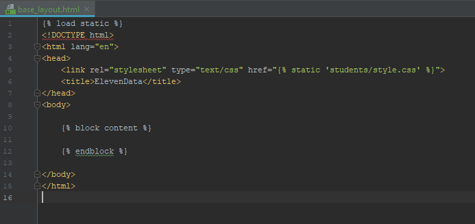
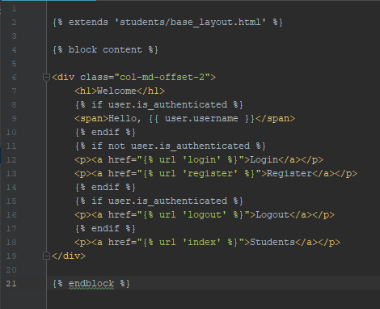

# 14 - Template Extending

Now that we have our basic functionality of our web site we can start to make it more modular and share common resources. Part of this task is starting up template extending. Template extending is defined as using multiple HTML Snippets to load one full HTML file. The Setup for this isn't terribly difficult but will require us to edit some files we already created

## Creating a Base Layout

The purpose of the file we will create next is to create the outer shell of the full file that we piece together. This will include the header tag, but the body will be removed. Lets see how this is done.

* Create a new file in `students/templates/students`called `base_layout.html`.
* copy the head tag from `landing.html` and paste it into the head tag of `base_layout` 
* Then, add `` to the top of the file to bring in the CSS we created earlier
* Next, add the following 2 lines underneath of the div we pasted. `` `` 
* You should have something that looks like the following image

Notice the new Jinja syntax _block_. This is what tells django that we intend on extending this template with other pieces of information. The name of this particular block is _content_. That means if django can match the names of the blocks, it will replace the jinja, with the HTML snippet we create next

## Extending Off of Base

* Open up `landing.html`. 
* remove everything except for the `div` tag inside of the body
* then add the following lines so your file looks like the image below

As mentioned before, on line 2 we see `extends students/base_layout.html`. If we load this template through a view, it will also load `base_layout`. This is because we specifically let django know where this template is extended from. We have to be cautious however, because if we misname the blocks, it will not work. We can have more than one block, as long as they are named right django will do all the work

Run the app. Notice anything different? You shouldn't, because we didn't really change anything. All we did was move where the materials were located. Like I said before, now that we have this `base_layout`, we can create more modular and consistent documents because they all reference the same head tag and link to the same style sheets.

## Challenge

Make the rest of the files in the `templates` directory extend from `base_layout`

