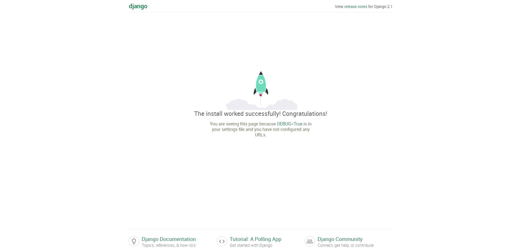

# 00 - Initial Setup

## Installing Django

Django is a Web Framework built on Python that allows us to build amazing, full stack, web applications very easily. To do this we need Django \(obviously\)

Open your terminal and run the following command

```text
pip install django
```


If you have multiple versions of python on your computer you may have to specify pip3 or python3 if you get errors


Once Django is installed, run the following command to make sure that the installation was successful and we can run Django commands

### For Windows

```text
python -m django --version
```

### For Mac

`django-admin --version`

If you don't see any errors, and you see 2.1.x, then you can move on to the next step.

## Creating the Project in the CLI

Normally we would create a project through PyCharm. This time we are going to use the CLI \(terminal\) to let django create a full starting project for us that we can work off of. CD into the directory of all your projects/ examples and run the following command

```
django-admin startproject eleven_data
```

once its finished, cd into `eleven_data` . and run the following command

```text
python manage.py runserver
```

at the base level of the directory that was created for our project is a manage.py module. This module allows us to execute terminal commands on our project

If everything went well it should say `Starting development server at http://127.0.0.1:8000/`. Use your browser to navigate to that domain and you should see something similar to the picture below



