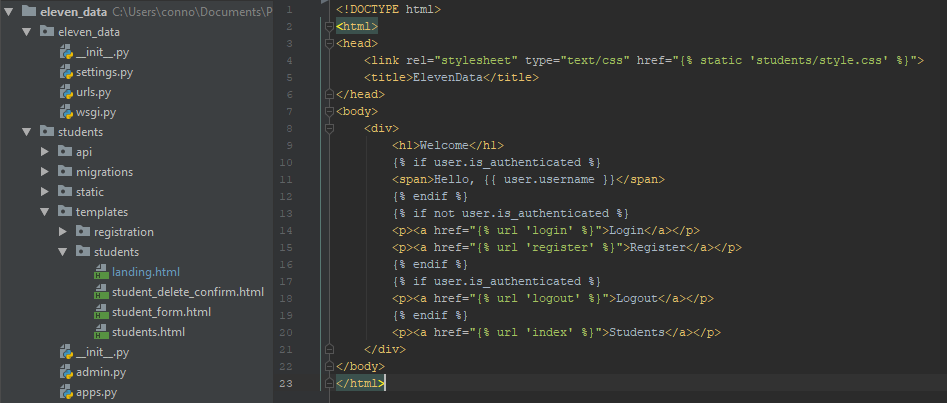
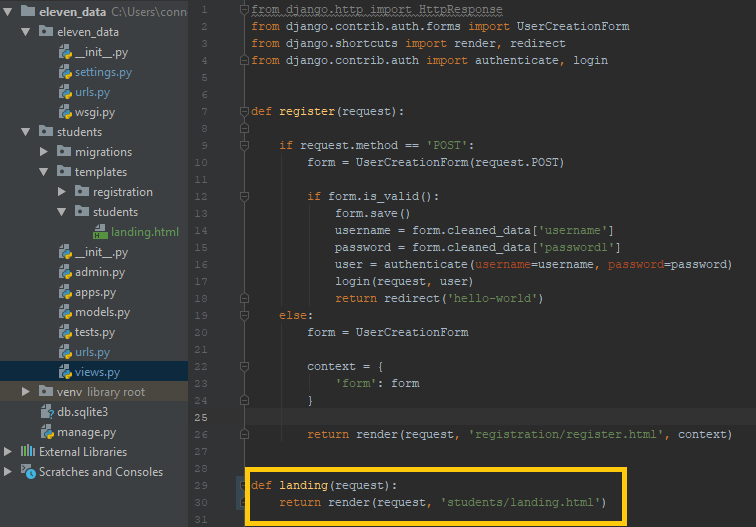
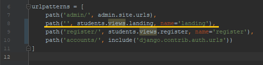

# 07 - A New Landing Page

## Routing with Buttons

We have had the same 'Hello World' view this whole time. Let's Spice it up.

Create a new Directory inside of templates, next to registration, and call it 'students'. Add a new HTML file to that directory and name it 'landing.html'. Then add the following lines of code to landing.html. 



Then change the view function 'index' inside of views.py and change it to the following function.



Now, inside of students/urls, delete everything in the list 'urlpatterns' as we don't need anything for students/urls to use. Then switch over to eleven\_data/urls and change the index element so it looks like the following snippet.



Finally, where we import `students` in eleven\_data/urls. Add `.views` to the end of `students` . So it looks like this

```text
import students.views
```

Run the server and refresh your browser. You should be redirected to a brand new landing page. Experiment with the buttons and make sure everything works before we move on to the next step.

