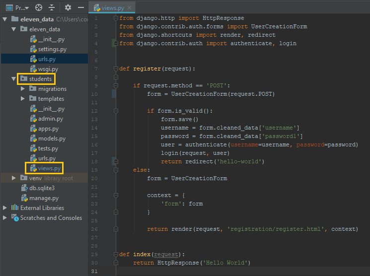
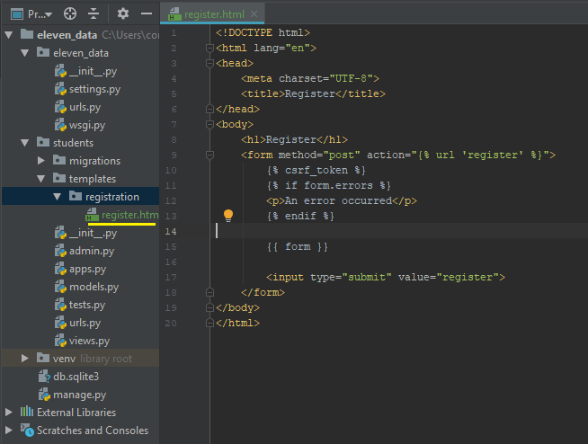

# 05 - Building the Registration

## HTTP Methods

HTTP stands for Hyper Text Transfer Protocol. This will look familiar as most website have this before the website name. HTTP allows us to send data over the web between servers and browsers. If you run your development server using `python manage.py runserver` and Navigate around the page, you'll see all of the _requests_ going to the browser. Right now you will see mostly **GET** requests. These requests are very straightforward. They _ask_ for information from the server and the server brings it back for the browser to display. This initial setup was done for us by django but its crucial to understand how it works. **GET** is an HTTP Verb. There are many of these verbs but we are going to focus only on a few. They include **GET**, **POST**, **PUT**, and **DELETE**. Notice that these four are pretty similar to our CRUD acronym. lets make our first form, this will be the registration page with authentication so our users can create accounts. In terms of HTTP Verbs, our users will be able to **POST** their credentials so they can login later on. So just like we did with our `index` function that returned hello world, we are going to write a register\(\) function inside of students/views.py. Add the following lines to that file

## The Register Function

This may look scary and intimidating, but if we take a second to digest what is going on, we can break it down into smaller segments and understand what we just added. 

Lets look at the first **if** statement, `if request.method == 'POST':` . Well what is request? request is our parameter that django passes around, it contains the user's authentication, the page that the user is trying to access, and alot of other stuff bundled into one object. The request also contains a specific HTTP method. So if the user is registering, and he is _posting_ his information to our database, the request.method will equal **POST**. We will see this in action soon enough. The form variable we are declaring is an instance of django's built in UserCreationForm that we have imported on line 2. This form is an HTML template that contains everything needed for registering a user. Everything after the inner if statement is saving the information that was entered, logs the user in using the login\(\) function, and redirects the user to the base url.

The second half is also really straightforward. We use the same form but now we see something different, this 1 element dictionary called context. Django allows us to send information to templates \(HTML snippet files\). On line 25 we see \`return render\(request, 'registration/register.html', context\). This function is what gives us our view, it is similar to HttpResponse\(\) that we used with hello world, but we can give it more information. We haven't built the register.html page yet but we will. Then we send context to the page so we can render the form. We will see how that works in the next section

## HTML in Django

Create a new folder in `students` called `templates`. Then add a new folder called `registration` inside of `templates`. Then add a new HTML file to registration and  add the following lines of code

Remember how I said we can send information to our templates? Look on line 11 and line 15, then go back to the register\(\) function and look at line 25. Django has this crazy syntax that allows us to write python code _inside_ of an HTML document. `` is for writing logic, and `{{ variable_name }}` is for accessing variables passed in with render\(\)

On line 10 we see `csrf_token` which stands for **C**ross **S**ite **R**equest **F**orgery Token. In other words, this is a basic level of security built in that prevents many forms of malicious attacks including SQL injection, Cross Site Scripting,  and CSRF attacks. This is known as _token based mitigation_.

## Routing to Register

Now that we have the template we need to make it accessible through our website. To do this, all we have to do is add the path to the register view in our eleven\_data/urls.py file like so

Now run the development server, if it is not already running, and add `/register/` to the end of the url. 

