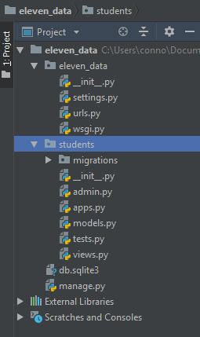
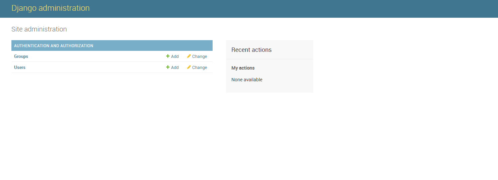

# 01 - Creating Our First App

## Django Apps

Apps in django are more like 'components' instead of actual apps. We use apps to seperate our project into multiple groups. To see this in action, head back to your terminal and open the project so that if you use `dir` or `ls` you see your manage.py module. then run the following command

```text
python manage.py startapp students
```

This will create a new sub-directory inside of our project that will hold everything we need for most of the project. Now, open the project in PyCharm. In our project explorer you should see something similar to the image below




Note that there is not a `venv` folder yet, we will add that once we start building out the project


## The Built in Admin Page

Like I said, django comes with a lot of cool stuff we can play around with. One of which being the Admin portal. This panel allows people with the right authentication to manage the overall project. Let's get started

First we need to create a superuser, a superuser is a step up above admin that has access to everything. Open terminal and run the two following commands

```text
python manage.py migrate  # we will go over this later
```

```text
python manage.py createsuperuser
```

This will cause an in terminal prompt to fill information for the superuser. Remember this information as we will need it in a second. Once you create the superuser account, run your development server using the following command

```text
python manage.py runserver
```

Just like before open your browser if it isn't open already, then append `/admin` to the url so it becomes `http://127.0.0.1/admin`. This will take you to the admin login page. Enter the credentials you created in the terminal and hit Log In

You should be redirected to the main admin portal and will look like this



##  

