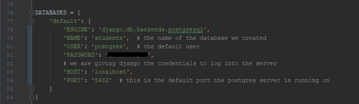
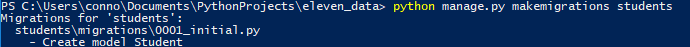
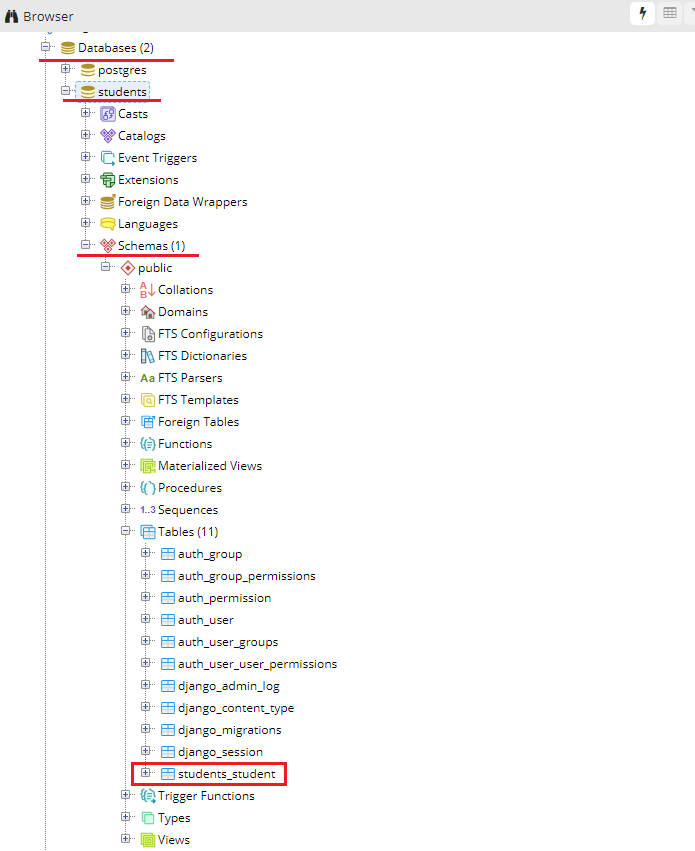
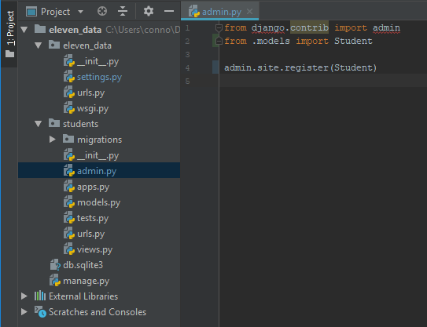

# 04 - Django Settings for PostgreSQL and Migrations

## Django Configuration

In PyCharm open up settings.py in the base directory of our project and scroll down until you see the list `DATABASES`. Add the following code to your settings.py file

  
Now that we have our database configured we can run a command to see if everything is working. Open up terminal and run the following line

`python manage.py makemigration`

You will see an error that should read 'No module named psycopg2'. We want this error because it tells us that the command was successful, we just don't have a package installed needed for it to run completely. So now all we have to do is install `pyscopg2` using pip, like so

`pip install psycopg2` 

Then run the makemigration command above again. You should see `No changes detected` 

Now that we _made_ the migration, we need to _perform_ the migration. In other words, we need to move the tables we code \(or were coded for us that came with the app\), and push it to our database. Doing this is real easy and is done with the following command in terminal

`python manage.py migrate` 

If this is the first migration you have done you will see alot of random `OK` 's. These are the tables that came with django for us to use for free. If we open up pgAdmin again and look at our students database and navigate through the drop downs to `students/schemas/public/tables` , we see all of the tables that were just migrated. Every time we change a table or add one, we will need to do a migration or it will cause an error, so remember if you change a model \(even a variable name\), we will need to migrate.

Now lets start working on adding the students model to our database. In settings.py, add `students` to installed apps like so

Next, we are going to run a new migration on students, use the following command in terminal

`python manage.py makemigrations students` 

Notice that this created a new file called `0001_initial.py`. This is the script that was generated when we made the migration. To run the migration we use the command below

`python manage.py sqlmigrate students 0001` 

Notice the new command sqlmigrate, this tells django that we are running a SQL migration to a database. Now that the migration is scripted, we run the old migrate command like we did with the original tables.

`python manage.py migrate` 

Go back to pgAdmin and look at the tables, you should see our students table with first\_name, last\_name, and gpa.

## Viewing our Model in the Admin Page

If we want to run CRUD functions \(**C**reate **R**ead **U**pdate **D**elete\) right off the bat, we can use the admin page to do that for us. Go to the students directory and open admin.py. Then add the following lines of code

Save and run the development server using `python manage.py runserver`. After that, navigate to the admin panel with `/admin` and log in. You should see a new tab called Students. Click on Add and create a new student. Create 5 new random students so we have pre-seeded data that we can use later on. Also play around with how the update and delete works, as we will be creating our own views and validation for this later on. 

