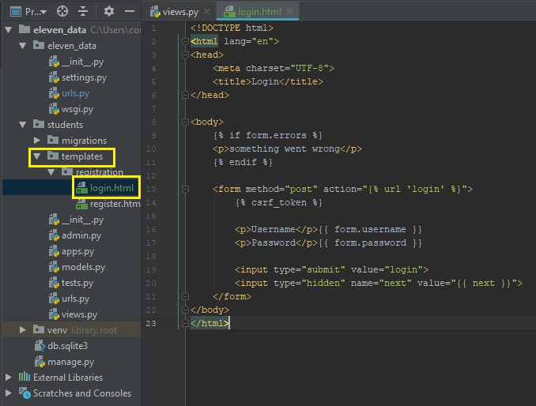

# 06 - Logging in our Users

## Routing

For logging in users, it's best to explain how this works when we set up our urls first. This is because django already has login authentication built into a module, we just have to give it a template afterwards because the view function is already built in. Lets hop into eleven\_data/urls.py, and add the following to `urlpatterns`.

```text
    path('accounts/', include('django.contrib.auth.urls'))
```

The accounts urls has many different functions that we can implement built in, including password recovery, password reset, and third party authentication. If you would like to read more into this, go to the django documentation here, [https://docs.djangoproject.com/en/2.1/topics/auth/default/](https://docs.djangoproject.com/en/2.1/topics/auth/default/)

## The Template

Add the following html file to templates/registration. It should be in the same folder as the register.html page.



Notice on line 13 inside of the form tag, we see `{% action="".` This is the built in function that logs the user in, and all we had to do was make the template and django will handle the rest.

If we run the server and head over to `/accounts/login` , we see our template. It's nothing special, just a couple forms and a button. Enter the credentials we created for our superuser or a user we made when testing our registration. Click submit. We should get an error. This is because we haven't set the login redirect url. Head over to settings.py and add the following two line at the bottom of the page.

```text
LOGIN_REDIRECT_URL = '/'
LOGOUT_REDIRECT_URL = '/'
```

This tells django where we want our user to navigate. In this case we want to get the user back to the home page. Save the project and try to log in again. You should see the main view page after clicking submit

