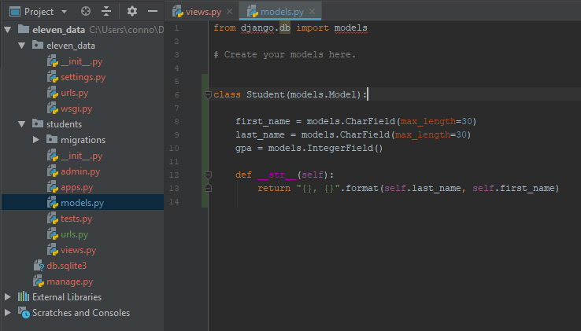
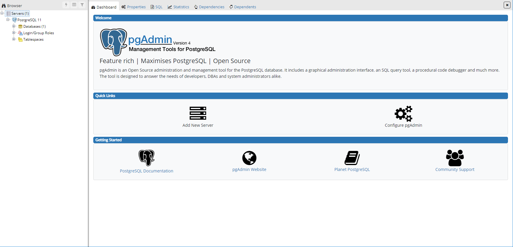

# 03 - Models and PostgreSQL

## Models

A Model is a class instance that will hold similar data. It is a mimic of what our tables are going to look like. They can hold user data, static data, and anything else we can need. A good way to think of a model is to think of the class as a box that gets sent back and forth between the database and the website.

## The Students Model

Django has a predetermined file that will hold the models we use in our app. Its called `models.py`. Navigate into students/models.py and add the following lines of code

Note that the Student class inherits from models.Model, this tells django that we are creating a model, and we need to perform database actions on that class. 

## PostgreSQL

Postgres is a Open Source Sql Server that is compatible with django. It's real easy to setup and very flexible, so we will be using it in our project. Their are other options such as MySQL and SQLite3 if you would like to explore on your own. 

Head over to [https://www.postgresql.org/](https://www.postgresql.org/) and click on download. Then choose the operating system that you are using, and wait for the installer to finish the download. Run the installer and click through the prompt. There will be a page that asks to create a password. Do NOT forget the password you choose, but also be cautious of using a common password as we will be putting it in our code. We will also be needing the password you created to continue on to the next step.

Once Postgres is installed, it should come with an application called pgAdmin. Search your machine for the app using cortana or finder, and open it. Depending on the machine and how it installed, it will either open in a new desktop app or in your browser, and will look like this

Once open, click servers &gt; postgreSQL 11 &gt; databases to open the full drop down. You should see 1 database already in that server. Right Click on databases and click create database. A new window will pop up asking for the details of the new database. name the database `students` and make sure the user is postgres, this is the default superuser. Click save, we do not need to worry about the other tabs right now or the comment section.

After we create the database, we can close out of pgAdmin. Next, we will be configuring our settings.py to connect to the database and migrating our model to create our first table.

