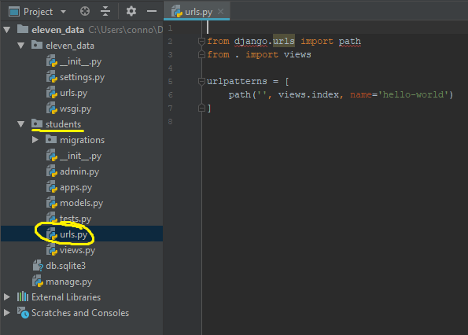
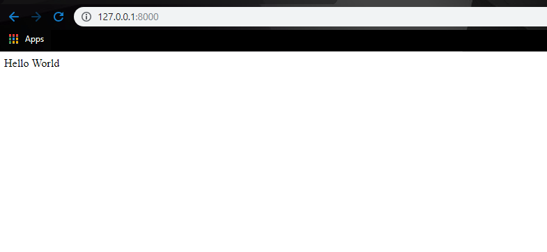

# 02 - Views, Urls, and Hello World

## URL's and Routing

Now that we've seen the admin portal that already has functionality built in, lets start coding our own views and paths. Navigate to `eleven_data/urls.py`. This file contains everything we need for how our urls interact with each other and how it will navigate around the website.

Let's get rid of the default blank page, go ahead and add the following code to your urls.py

  
Remember how we added `admin/` to the end of our url to get to the admin page? This file is where thats located. The first element in `url patterns` tells django "if i see admin appended to the end of the base url, redirect to the admin page". Likewise, if nothing is appended \(the newest element is blank, this will replace the default landing page\), INCLUDE students.urls. We haven't built that out yet so let's do that now.

 Create new Python file in the `students` directory, and name it `urls.py`, just like the other urls.py file we just edited. Remember that this is the app that we created earlier, this app will have views that are completely independent from the rest of the site. Add the following code to the newly created file

  
If we look back at eleven\_data/urls.py we see  `include('students.urls')`, inside of one of our path function calls. This statement acts as kind of a pointer to the urls.py file we created. 

## Views

Now that we have all the urls we need and routed correctly, lets go ahead and knock out a view. Views in Django are functions or classes. If we look at the picture above we see the snippet `views.index` on line 6. `index` is going to be a function, we just haven't made it yet


**Q:** If index is a function why are there no parenthesis?

**A:** That's because the parenthesis are for _calling_ functions, when we remove the parenthesis we are passing an _instance_ of the function, kind of like how we create instances of classes. We aren't executing the function when we do this, we are just giving that instance of the function to django


Inside of students add the following function to `views.py`

  
Go ahead and save it, and run `python manage.py runserver` in terminal. Once it opens you should see a different view instead of the rocket ship

 

  

